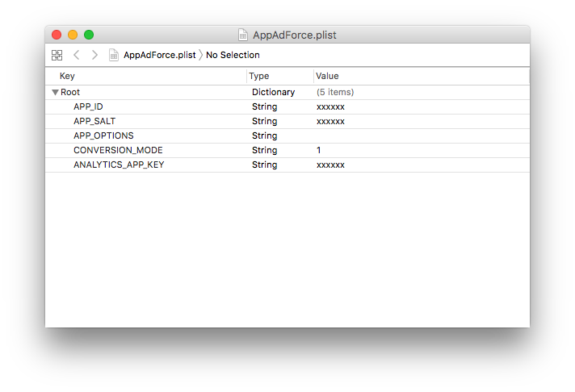

# Force Operation Xとは

Force Operation X (以下F.O.X)は、スマートフォンにおける広告効果最適化のためのトータルソリューションプラットフォームです。アプリケーションのダウンロード、ウェブ上でのユーザーアクションの計測はもちろん、スマートフォンユーザーの行動特性に基づいた独自の効果計測基準の元、企業のプロモーションにおける費用対効果を最大化することができます。

本ドキュメントでは、スマートフォンアプリケーションにおける広告効果最大化のためのF.O.X SDK導入手順について説明します。

## 目次

* **[1. インストール](#install_sdk)**
	* [SDKダウンロード](https://github.com/cyber-z/public-fox-ios-sdk/releases)
  * [インストール手順の詳細](./doc/integration/README.md)
* **[2. 設定](#setting_sdk)**
  * [SDK設定の詳細](./doc/config_plist/README.md)
* **[3. インストール計測の実装](#tracking_install)**
	* [sendConversionWithStartPage:の詳細](./doc/send_conversion/README.md)
	* [ディファードディープリンクの実装](./doc/deferred_deeplink/README.md)
* **[4. LTV計測の実装](#tracking_ltv)**
	* [タグを利用したLTV計測について](./doc/ltv_browser/README.md)
* **[5. アクセス解析の実装](#tracking_analytics)**
  * [アクセス解析によるイベント計測](./doc/analytics_event/README.md)
  * [アクセス解析による課金計測](./doc/analytics_purchase/README.md)
  * [エンゲージメント配信について](./doc/fox_engagement/README.md)
* **[6. 疎通テストの実施](#integration_test)**
	* [リエンゲージメント計測を行う場合のテスト手順](./doc/reengagement_test/README.md)
* **[7. その他機能の実装](#other_function)**
  * [オプトアウトの実装](./doc/optout/README.md)
* **[8. 最後に必ずご確認ください](#trouble_shooting)**
  * [FAQ・注意事項](./doc/trouble_shooting/README.md)

## F.O.X SDKとは

F.O.X SDKをアプリケーションに導入することで、以下の機能を実現します。

* **インストール計測**

広告流入別にインストール数を計測することができます。

* **LTV計測**

流入元広告別にLife Time Valueを計測します。主な成果地点としては、会員登録、チュートリアル突破、課金などがあります。各広告別に登録率、課金率や課金額などを計測することができます。

* **アクセス解析**

自然流入と広告流入のインストール比較。アプリケーションの起動数やユニークユーザー数(DAU/MAU)。継続率等を計測することができます。


<div id="install_sdk"></div>

## 1. インストール
* **CocoaPodsによって導入する場合**

Podfileファイルに下記の設定を追加してください。
```ruby
# 下記の一行をPodfileの一番最初に追加してください
source "https://github.com/cyber-z/public-fox-ios-sdk.git"

# 下記を指定したいターゲットに追加してください
pod "CYZFox", "<VERSION>"
```
> * `3.4.0` から[CocoaPods Private Pods](https://guides.cocoapods.org/making/private-cocoapods.html) で提供するため、\<VERSION\>は `3.4.0` 以上のバージョンを指定してください。
> * `3.3.0` 以下の導入方法は[過去のリリースタグ履歴](https://github.com/cyber-z/public-fox-ios-sdk/releases)へ参考してください。
> * `4.0.0` は下位互換性持たないため管理者に問い合わせしてから指定してください。

<br />

* **マニュアル導入する場合**

以下のページより最新のSDKをダウンロードしてください。

[SDKリリースページ](https://github.com/cyber-z/public_fox_ios_sdk/releases)

既にアプリケーションにSDKが導入されている場合には、[最新バージョンへのアップデートについて](./doc/update/README.md)をご参照ください。

ダウンロードしたSDK「FOX_iOS_SDK_<version>.zip」を展開し、以下ファイルをXcodeの任意の場所にコピーを行い、アプリケーションのプロジェクトに組み込んでください。

各ファイルの説明は以下の通りです。

<table>
<tr><th>機能名</th><th>必須</th><th>ファイル名</th></tr>
<tr><td>ライブラリ本体</td><td>必須</td><td>libFoxSdk.a</td></tr>
<tr><td>インストール計測</td><td>必須</td><td>AdManager.h</td></tr>
<tr><td>LTV計測</td><td>オプション</td><td>Ltv.h</td></tr>
<tr><td>アクセス計測</td><td>オプション</td><td>AnalyticsManager.h</td></tr>
</table>


[インストール手順の詳細](./doc/integration/README.md)

<div id="setting_sdk"></div>

## 2. 設定

* **フレームワーク設定**

次のフレームワークをプロジェクトにリンクしてください。

<table>
<tr><th>フレームワーク名</th><th>Status</th></tr>
<tr><td>AdSupport.framework</td><td>Optional</td></tr>
<tr><td>Security.framework </td><td>Required </td></tr>
<tr><td>StoreKit.framework </td><td>Required </td></tr>
</table>


* **SDK設定**

SDKの動作に必要な設定をplistに追加します。「AppAdForce.plist」というファイルをプロジェクトの任意の場所に作成し、次のキーと値を入力してください。

Key | Type | Value
:---: | :---: | :---
APP_ID | String | Force Operation X管理者より連絡しますので、その値を入力してください。
APP_SALT | String | Force Operation X管理者より連絡しますので、その値を入力してください。
APP_OPTIONS | String | 何も入力せず、空文字の状態にしてください。
CONVERSION_MODE | String | 1
ANALYTICS_APP_KEY | String | Force Operation X管理者より連絡しますので、その値を入力してください。<br />アクセス解析を利用しない場合は設定の必要はありません。




* **App Transport Securityについて**

F.O.Xが提供する全てのサーバーはHTTPS通信に対応しています。
2016年11月以前からF.O.Xを導入している場合はHTTPSでの通信を行うための設定が入っていない可能性がありますので、管理画面からAppAdForce.plistをダウンロードして導入してください。

[SDK設定の詳細](./doc/config_plist/README.md)

[AppAdForce.plistサンプル](./doc/config_plist/AppAdForce.plist)

* **Swift Bridging Headerの編集**

Swiftで開発する場合、下記の記述をBridging Headerファイルに追加してください。
```objc
#import "AdManager.h"
#import "Ltv.h"
#import "AnalyticsManager.h"
```

<div id="tracking_install"></div>

## 3. インストール計測の実装

初回起動のインストール計測を実装することで、広告の効果測定を行うことができます。
また、iOS9より初回起動時のブラウザ起動からアプリに戻る際に、ダイアログが出力されます。
F.O.X SDKではiOS9からリリースされた新しいWebView形式である “SFSafariViewController”を初回起動時に起動させ計測することで、ダイアログ表示によるユーザービリティの低下を防止することが出来ます。

インストール計測を行うために、以下のメソッドを実装します。

メソッド | 実装箇所 | 概要
:---: | :---: | :---
setStartPageVisible|didFinishLaunchingWithOptions:|(任意) sendConversionWithStartPageの前に実装を行ってください。SFSafariViewControllerを非表示する場合、`NO` を設定します。(デフォルト:`YES`)
sendConversionWithStartPage:|didFinishLaunchingWithOptions:|(必須) 初回起動時のインストール計測
setUrlScheme:|openURL:|(必須) 初回起動時のインストール計測の制御及び、URLスキーム経由の計測処理
setBuid:|openURL:|(任意)URLスキーム経由の計測処理する際に、広告主端末ID`buid`を設定する

プロジェクトのソースコードを編集し、Application Delegateの`application:didFinishLaunchingWithOptions:`に次の通り実装を行ってください。

`sendConversionWithStartPage:`の引数には、通常は上記の通り@"default"という文字列を入力してください。
```objective-c
#import "AdManager.h"

// - (BOOL)application:(UIApplication *)application
//   didFinishLaunchingWithOptions:(NSDictionary *)launchOptions {

  [[AppAdForceManager sharedManager] sendConversionWithStartPage:@"default"];

  return YES; // openURL:メソッドをコールさせるため必ずYESを返してください
// }
```

```objective-c
// - (BOOL)application:(UIApplication *)application openURL:(NSURL *)url
//                sourceApplication:(NSString *)sourceApplication annotation:(id)annotation {

          [[AppAdForceManager sharedManager] setUrlScheme:url];

          return YES;
// }
```

> `sendConversionWithStartPage:`メソッドは、端末がiOS9の場合、且つCookie計測実施の場合はSFSafariViewControllerを起動し計測を行います。

> `setUrlScheme:`メソッドは、URLスキームへ遷移する広告経由のアプリケーションの起動計測、SFSafariViewControllerが起動された際の制御処理及び、ディファードディープリンクに関する処理も行っておりますので、必ず`openURL:`メソッドが呼ばれるように実装してください。

> ※ ”`openURL:(NSURL *)url options:(NSDictionary<NSString*, id> *)options`”をお使いの場合にもsetUrlScheme:メソッドは実装してください。

[sendConversionWithStartPage:の詳細](./doc/send_conversion/README.md)

[ディファードディープリンクの実装](./doc/deferred_deeplink/README.md)

* **Fingerprinting計測時の注意事項**

Fingerprinting計測はWebViewを使用しており、UserAgentを独自のカスタマイズを行っている場合正常に計測することが出来なくなります。
WebViewのUserAgentを独自の文字列にカスタマイズを行う前に次のメソッドを必ず実装してください。
```objc
[[AppAdForceManager sharedManager] cacheDefaultUserAgent];
```

<div id="tracking_ltv"></div>

## 4. LTV計測の実装

会員登録、チュートリアル突破、課金など任意の成果地点にLTV計測を実装することで、流入元広告のLTVを測定することができます。LTV計測が不要の場合には、本項目の実装を省略できます。

```objective-c
#import "Ltv.h"
// ...
AppAdForceLtv *ltv = [[[AppAdForceLtv alloc] init] autorelease];
[ltv sendLtv:{成果地点ID}];
```

LTV計測を行うためには、各成果地点を識別する成果地点IDを指定する必要があります。sendLtvの引数に発行されたIDを指定してください。

課金計測を行う場合には、課金が完了した箇所で以下のように課金額と通貨コードを指定してください。

```objective-c
#import "Ltv.h"
// ...
AppAdForceLtv *ltv = [[[AppAdForceLtv alloc] init] autorelease];
[ltv addParameter:LTV_PARAM_PRICE:@"9.99"];
[ltv addParameter:LTV_PARAM_CURRENCY:@"USD"];
[ltv sendLtv:{成果地点ID}];
```

\_currencyには[ISO 4217](http://ja.wikipedia.org/wiki/ISO_4217)で定義された通貨コードを指定してください。

* [sendLtvの詳細](./doc/send_ltv_conversion/README.md)
* [タグを利用したLTV計測について](./doc/ltv_browser/README.md)

<div id="tracking_analytics"></div>

## 5. アクセス解析の実装

自然流入と広告流入のインストール数比較、アプリケーションの起動数やユニークユーザー数(DAU/MAU)、継続率等を計測することができます。アクセス解析が不要の場合には、本項目の実装を省略できます。

アプリケーションの起動、及びバックグラウンドからの復帰を計測するために、application:didFinishLaunchingWithOptions:およびapplicationWillEnterForegroundにコードを追加します。

※バックグラウンドフェッチを利用している場合、バックグラウンド起動時にOS側がapplication:didFinishLaunchingWithOptions:をコールしています。バックグラウンド時は起動計測F.O.Xメソッドが呼ばれないようにapplicationStateにて状態判定をおこなってください。

```objective-c
#import "AnalyticsManager.h"

// - (BOOL)application:(UIApplication *)application
//   didFinishLaunchingWithOptions:(NSDictionary *)launchOptions {

    If ([application applicationState] == UIApplicationStateBackground) {
        //バックグラウンド時の処理
    } else {
        //バックグラウンド時は起動計測が呼ばれないようにする
        [ForceAnalyticsManager sendStartSession];
    }

//}

// - (void)applicationWillEnterForeground:(UIApplication *)application {

    [ForceAnalyticsManager sendStartSession];

//}
```

sendStartSessionは必ず上記二カ所に実装を行ってください。

[アクセス解析によるイベント計測](./doc/analytics_event/README.md)

[アクセス解析による課金計測](./doc/analytics_purchase/README.md)

[エンゲージメント配信について](./doc/fox_engagement/README.md)


<div id="integration_test"></div>

## 6. 疎通テストの実施

マーケットへの申請までに、SDKを導入した状態で十分にテストを行い、アプリケーションの動作に問題がないことを確認してください。

インストール計測の通信は、起動後に一度のみ行わるため、続けて効果測定テストを行いたい場合には、アプリケーションをアンインストールし、再度インストールから行ってください。

* **テスト手順**

1. テスト用端末にテストアプリがインストールされている場合には、アンインストール
1. テスト用端末の「設定」→「Safari」→「Cookieとデータを消去」によりCookieを削除
1. 弊社より発行したテスト用URLをクリック
1. マーケットへリダイレクト
1. テスト用端末にテストアプリをインストール<br />
1. アプリを起動<br />
アプリ起動時の挙動はF.O.Xの設定とテスト端末によって異なります。<br />
Cookie計測を実施の場合、iOS9未満の端末では、Safariブラウザが起動します。<br />
iOS9以上の端末は、SFSafariViewControllerが起動します。但し、`setStartPageVisible:NO`を設定している場合はSFSafariViewControllerもSafariも起動しません。<br />
Cookie計測を実施していない場合は、ブラウザは起動しません。<br />
上記の挙動とならない場合は、正常に設定や実装が行われていません。設定を見直していただき、問題が見当たらない場合には弊社へご連絡ください。<br />
1. LTV地点まで画面遷移<br />
1. アプリを終了し、バックグラウンドからも削除<br />
1. 再度アプリを起動<br />

弊社へ3、6、7、9の時間をお伝えください。正常に計測が行われているか確認いたします。弊社側の確認にて問題がなければテスト完了となります。

> テスト用URLは必ず標準のSafari上でリクエストされるようにしてください。Chromeなどの3rd partyブラウザ、メールアプリやQRコードアプリを利用されそのアプリ内WebViewで遷移した場合には計測できません。

> テストURLをクリックした際に、遷移先がなくエラーダイアログが表示される場合がありますが、疎通テストにおいては問題ありません。


[リエンゲージメント計測を行う場合のテスト手順](./doc/reengagement_test/README.md)

<div id="other_function"></div>

## 7. その他機能の実装

* [オプトアウトの実装](./doc/optout/README.md)

<div id="trouble_shooting"></div>

## 8. 最後に必ずご確認ください

* [FAQ・注意事項](./doc/trouble_shooting/README.md)

---
[メインメニュー](/README.md)
