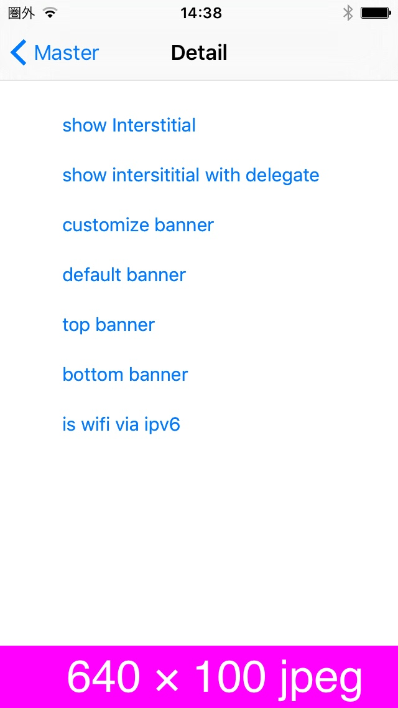
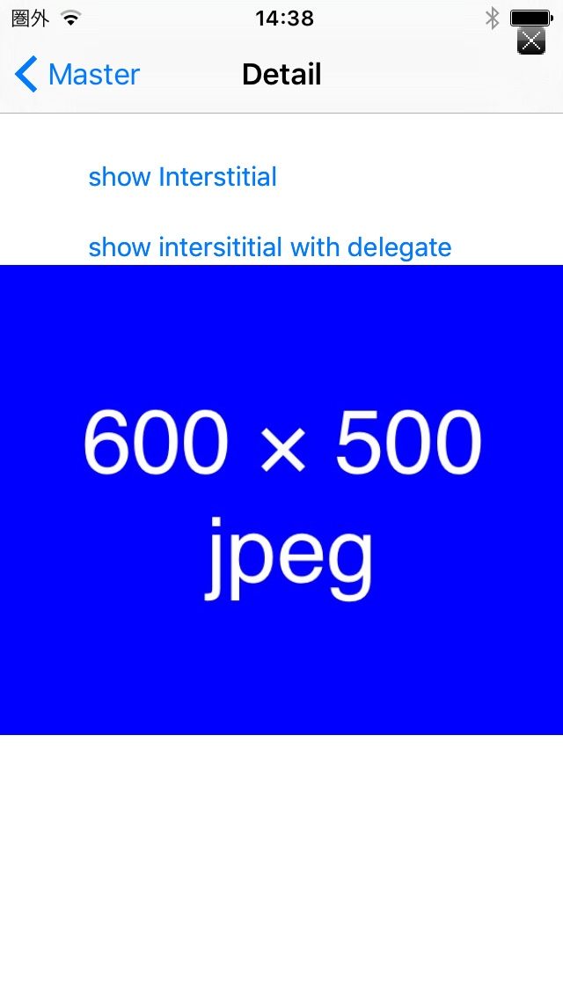

# 広告配信機能

## 1. 必須ライブラリ

* libDahliaSdk.a
* DLBannerView.h
* DLInterstitialViewController.h
* DLAdStateDelegate.h

## 2. 必要なframework
* UIKit.framework
* Foundation.framework
* Security.framework
* SystemConfiguration.framework
* AdSupport.framework

## 3. plist設定ファイル
**ファイル名**

`AppAdForce.plist`

**設定項目**
* `APP_ID` 値は案件開始時に弊社より発行させて頂くIDとなります。
広告表示に必須となります。

## 4. API

### DLBannerView
|プローパティー|タイプ|詳細|
|---:|:---|:---|
|placementId|NSString|広告表示ID(管理者より発行されます)|
|adStateDelegate|id<DLAdStateDelegate>|広告表示の際のイベントを取得するためのdelegate|

|返り値型|メソッド|詳細|
|---:|:---|:---|
|void|show|バナー広告を表示します。|

### DLInterstitialViewController
|プローパティー|タイプ|詳細|
|---:|:---|:---|
|placementId|NSString|広告表示ID(管理者より発行されます)|
|adStateDelegate|id<DLAdInterstitialStateDelegate>|広告表示の際のイベントを取得するためのdelegate|

|返り値型|メソッド|詳細|
|---:|:---|:---|
|void|`+(void) showInterstitial:(NSString* _Nonnull) placementId InController:(UIViewController* _Nonnull) controller`<br><br>`placementId` : 広告表示ID (管理者より発行されます)<br>`controller` : 親ViewController|インタースティシャル広告を表示するヘルパーメソッド。|
|void|`+(void) showInterstitial:(NSString* _Nonnull) placementId InController:(UIViewController* _Nonnull) controller WithDelegate:(id<DLAdInterstitialStateDelegate> _Nullable) adDelegate`<br><br>`placementID` : 広告表示ID (管理者より発行されます)<br>`controller` : 親ViewController <br>`adDelegate` : 広告表示のイベントを取得するためのdelegate|インタースティシャル広告を表示するヘルパーメソッド。|


## 5. コードへの組み込み

### 5.1 バナー広告表示サンプル その１

```objc
NSString* placementId = xxx; // 管理者より発行される
CGRect frame = xxx;// 指定したい場所とサイズ
DLBannerView* adView = [][DLBannerView alloc] initWithFrame:frame];
adView.placementId = placementId;
[parentView addSubview:adView];
[adView show];
```

### 5.2 バナー広告表示サンプル その２

```objc
NSString* placementId = xxx; // 管理者より発行される
CGRect frame = xxx;// 指定したい場所とサイズ
DLBannerView* adView = [][DLBannerView alloc] initWithFrame:frame];
adView.placementId = placementId;
[parentView addSubview:adView];
view.adStateDelegate = bannerStateDelegate;
[adView show];


// DLBannerStateDelegate 実装
-(void) onAdSuccess:(UIView *) view {
    NSLog(@"onAdSuccess delegate implement");
}

-(void) onAdFailed:(UIView *) view {
    NSLog(@"onAdFailed delegate implement");
}
```

### 5.3 インタースティシャル広告表示サンプル その１

```objc
// 表示
NSString* placementId = xxx; // 管理者より発行される
[DLInterstitialViewController showInterstitial:placementId InController:currentViewCtrl];
```

### 5.4 インタースティシャル広告表示サンプル その２

```objc
// 表示
NSString* placementId = xxx; // 管理者より発行される
[DLInterstitialViewController showInterstitial:placementId InController:currentViewCtrl WithDelegate:interstitialDelegate];


// DLAdInterstitialStateDelegate 実装
-(void) onAdSuccess:(UIView *) view {
    NSLog(@"onAdSuccess delegate implement");
}

-(void) onAdExit {
    NSLog(@"onAdExit delegate implement");
}

-(void) onAdFailed:(UIView *) view {
    NSLog(@"onAdFailed delegate implement");
}

```

> 使用例 : 画面A→画面Bへ遷移する際、インタースティシャル広告を表示してから遷移させるなど<br>
（画面A→インタースティシャル広告→画面B）<br>その場合、画面Aにて上記実装を行い、`onAdSuccess`,`onAdFailed`,`onAdExit`の各々のメソッド内に画面Bへの遷移する処理を実装することで可能となります。

## 6. 表示サンプル

<table>
<tr>
<td align="center" style="border-style:none;">[バナー広告サンプル]</td>
<td align="center" style="border-style:none;">[インタースティシャル広告サンプル]</td>
</tr>
<tr>
<td style="border-style:none;"></td>
<td style="border-style:none;"></td>
</tr>
</table>

---
[トップ](/lang/ja/README.md)
