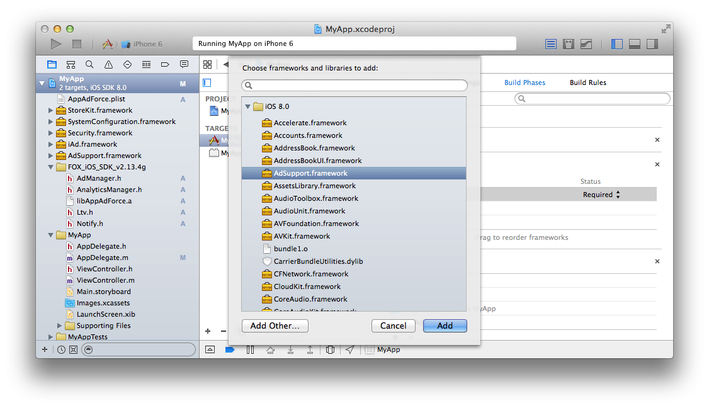
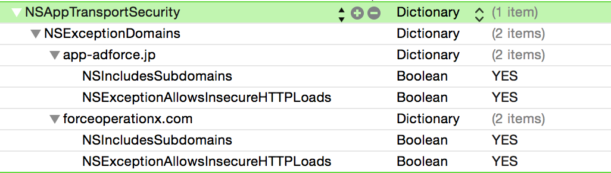

# Force Operation X 란?

Force Operation X (이하 F.O.X)는 스마트폰의 광고 효과 최적화를 위한 토탈 솔루션 플랫폼 입니다. 앱의 다운로드, 웹상에서의 사용자 액션의 측정은 물론, 스마트폰 사용자의 행동 특성에 근거한 독자적인 효과 측정기준을 바탕으로 기업의 프로모션의 비용효과를 극대화 할 수 있습니다.

본 문서에서는 스마트폰 앱의 광고 효과 극대화를 위한 F.O.X SDK 설치 단계에 대해 설명합니다.

## F.O.X SDK 란?

F.O.X SDK를 앱에 설치함으로써 아래와 같은 기능을 제공합니다.

* **설치 계측**

광고 유입별 설치 횟수를 측정 할 수 있습니다.

* **LTV 측정**

유입원 광고별로 Life Time Value를 측정합니다. 주요 성과 지점으로는 회원 가입, 튜토리얼 돌파, 결제 등이 있습니다. 각 광고별 등록률, 과금률, 과금액 등을 측정 할 수 있습니다.

* **액세스 해석**

자연 유입과 광고 유입의 설치 비교, 앱의 기동수, 유니크 사용자수(DAU/MAU), 지속률 등을 측정 할 수 있습니다.

## 1. 설치
* **CocoaPods 이용**

Podfile 파일에 다음의 설정을 추가합니다.

```ruby
# put this line at the first of the Podfile
source "https://github.com/cyber-z/public-fox-ios-sdk.git"

# indicate FOX SDK version
pod "CYZFox", "<VERSION>"
```
> * `3.4.0` 부터 [CocoaPods Private Pods](https://guides.cocoapods.org/making/private-cocoapods.html)로써 제공드리므로 <VERSION>은 `3.4.0` 이상의 버전을 지정하여 주십시오
> * `3.3.0` 이하의 도입방법은 과거의 [릴리스 이력](https://github.com/cyber-z/public-fox-ios-sdk/releases)을 참고하여 주십시오
> * `4.0.0` 은 하위 호환성이 없으므로 관리자에 문의하여 지정하여 주십시오

<br />

* **직접 설치**

아래의 페이지에서 최신의 SDK를 다운로드 하십시오.

[SDK 릴리스 페이지](https://github.com/cyber-z/public_fox_ios_sdk/releases)

이미 앱에 SDK가 설치되어있는 경우에는,[최신 버전에 대한 업데이트에 대해](./doc/update/README.md)를 참조하십시오.

다운로드한 SDK　「FOX_iOS_SDK_<version>.zip」의 압축을 풀고, 앱의 프로젝트에 추가합니다.

각 파일의 설명은 다음과 같습니다.

<table>
<tr><th>기능명</th><th>필수</th><th>파일명</th></tr>
<tr><td>라이브러리 본체</td><td>필수</td><td>libAppAdForce.a</td></tr>
<tr><td>인스톨 계측</td><td>필수</td><td>AdManager.h</td></tr>
<tr><td>LTV 계측</td><td>옵션</td><td>Ltv.h</td></tr>
<tr><td>액세스 계측</td><td>옵션</td><td>AnalyticsManager.h</td></tr>
</table>


[SDK 설치 상세 설명](./doc/integration/README.md)

## 2. 설정

* **프레임워크 설정**

다음의 프레임워크를 프로젝트에 추가해 주십시오.

<table>
<tr><th>프레임워크명</th><th>Status</th></tr>
<tr><td>AdSupport.framework</td><td>Optional</td></tr>
<tr><td>Security.framework </td><td>Required </td></tr>
<tr><td>StoreKit.framework </td><td>Required </td></tr>
</table>




* **SDK 설정**

SDK의 동작에 필요한 설정을 plist에 추가합니다. 「AppAdForce.plist」이라는 파일을 프로젝트의 임의의 장소에 작성하고, 다음의 키와 키값을 입력합니다.

Key | Type | Value
:---: | :---: | :---
APP_ID | String | Force Operation X 관리자가 연락합니다. 그 값을 입력하십시오.
SERVER_URL | String | Force Operation X 관리자가 연락합니다. 그 값을 입력하십시오.
APP_SALT | String | Force Operation X 관리자가 연락합니다. 그 값을 입력하십시오.
APP_OPTIONS | String | 아무것도 입력하지 마시고 빈문자의 상태로 해 주십시오.
CONVERSION_MODE | String | 1
ANALYTICS_APP_KEY | String | Force Operation 관리자가 연락합니다. 그 값을 입력하십시오.<br />액세스 해석을 이용하지 않으면 설정은 필요 없습니다.


* **App Transport Security에 대해서**

iOS9 부터 제공된 NSAppTransportSecurity(이하, ATS)를 유효로 한 경우, Info.plist에 이하와 같이 설정 하여 F.O.X SDK와 통신하는 곳의 도메인을 ATS의 예외에
추가하여 주십시오.

키 | 타입 | 개요
:---: | :---: | :---
NSExceptionDomains|Dictionary|ATS의 예외를 지정하는 딕셔너리
지정 도메인 문자열|Dictionary|다음의 두개의 도메인을 키로 작성해 주십시오. <br>・app-adforce.jp<br>・forceoperationx.com
NSExceptionAllowsInsecureHTTPLoads|Boolean|YES로 지정하여 ATS의 에외로 지정합니다.
NSIncludesSubdomains|Boolean|YES로 지정하여 ATS의 예외설정을 서브 도메인도 적용합니다.



[SDK설정의 상세](./doc/config_plist/README.md)

[AppAdForce.plist샘플](./doc/config_plist/AppAdForce.plist)

## 3. 인스톨 계측의 구현

초기 기동의 인스톨 계측을 구현하는 것으로, 광고의 효과 계측이 가능해집니다.
또, iOS9 부터 초기 기동시의 브라우저가 기동한 후 앱 화면으로 복귀시, 다이얼로그가 표시됩니다.
F.O.X SDK에서는 iOS9에서 릴리스 된 새로운 WebView 형식인 “SFSafariViewController”을 초기 기동 시에 기동시켜 측정하는것으로, 다이얼로그 표시에 따른 유저빌리티의 저하를 방지할 수 있습니다.

인스톨 계측을 하기 위해서는, 다음의 2개의 메소드를 구현합니다.

메소드 | 구현장소 | 개요
:---: | :---: | :---
sendConversionWithStartPage:|didFinishLaunchingWithOptions:|(필수) 초기 기동 시의 인스톨 계측
setUrlScheme:|openURL:|(필수) 초기 기동 시의 인스톨 계측의 제어 및, URL 스키마 경유의 계측 처리

프로젝트에서 Application Delegate의 `application:didFinishLaunchingWithOptions:`를 다음과 같이 구현해 주십시오.

`sendConversionWithStartPage:`의 매개변수에는, 특별한 이유가 없을 때에는 @"default"를 넣어 주십시오.

```objective-c
#import "AdManager.h"

// - (BOOL)application:(UIApplication *)application
//   didFinishLaunchingWithOptions:(NSDictionary *)launchOptions {

  [[AppAdForceManager sharedManager] sendConversionWithStartPage:@"default"];

  return YES; // openURL:메소드를 호출하기 위해서는 YES를 리턴해 주십시오.
// }
```

```objective-c
// - (BOOL)application:(UIApplication *)application openURL:(NSURL *)url
//                sourceApplication:(NSString *)sourceApplication annotation:(id)annotation {

          [[AppAdForceManager sharedManager] setUrlScheme:url];

          return YES;
// }
```

> `sendConversionWithStartPage:`메소드는, iOS9의 경우, 또는 Cookie 계측을 실시 할 경우는 SFSafariViewController를 기동하여 계측합니다.

> `setUrlScheme:`메소드는, URL 스키마에 이동하는 광고경유의 앱의 기동 계측 및,
SFSafariViewController가 기동될때의 제어 처리를 하고 있으므로, 반드시 `openURL:`메소드를 호출하도록 구현해 주십시오.

> ※ ”`openURL:(NSURL *)url options:(NSDictionary<NSString*, id> *)options`”를 사용하는 경우도 setUrlScheme: 메소드를 구현해 주십시오.


[sendConversionWithStartPage:의 상세](./doc/send_conversion/README.md)


* **Fingerprinting 계측 시의 주의사항**

Fingerprinting 계측은 WebView를 사용하고 있어, UserAgent를 독자적으로 커스터마이즈한 경우에는 정상적으로 계측 할 수 없습니다.
WebView의 UserAgent를 커스터마이즈 하기 전에 다음의 메소드를 반드시 구현해 주십시오.

```objc
[[AppAdForceManager sharedManager] cacheDefaultUserAgent];
```

## 4. LTV 계측의 구현

회원등록, 튜토리얼 돌파, 과금 등의 임의의 성과 지점에 LTV 계측을 구현하는 것으로, 유입원 광고의 LTV를 계측할 수 있습니다.
LTV 계측이 불필요한 경우에는, 본 구현을 생략해 주십시오.

```objective-c
#import "Ltv.h"
// ...
AppAdForceLtv *ltv = [[[AppAdForceLtv alloc] init] autorelease];
[ltv sendLtv:{성과지점ID}];
```
LTV 계측을 하기 위해서는, 각 성과 지점을 식별하는 성과지점 ID를 지정할 필요가 있습니다. sendLtv의 매개변수에 발행된 ID를 지정해 주십시오.

과금 계측을 하는 경우에는, 과금이 완료된 장소에 다음과 같이 과금액과 통화코드를 지정해 주십시오.

```objective-c
#import "Ltv.h"
// ...
AppAdForceLtv *ltv = [[[AppAdForceLtv alloc] init] autorelease];
[ltv addParameter:LTV_PARAM_PRICE:@"9.99"];
[ltv addParameter:LTV_PARAM_CURRENCY:@"USD"];
[ltv sendLtv:{성과지점ID}];
```

\_currency에는[ISO 4217](https://ko.wikipedia.org/wiki/ISO_4217)에 정의된 통화 코드를 지정해 주십시오.

[sendLtv의 상세](./doc/send_ltv_conversion/README.md)

[태그를 이용한 LTV계측에 대하여](./doc/ltv_browser/README.md)

## 5. 액세스 해석의 구현

자연 유입과 광고 유입의 인스톨 수 비교, 앱의 기동 수, 유니크 유저수(DAU/MAU), 유지율 등을 계측하는 것이 가능합니다. 액세스 해석이 불필요한 경우에는, 본 구현을 생략해도 됩니다.

앱의 기동,및 백그라운드로부터의 복귀를 계측하기 위해서, application:didFinishLaunchingWithOptions: 및 applicationWillEnterForeground에 코드를 추가합니다.

※백그라운드 패치를 이용하고 있는 경우, 백그라운드 기동 시에 OS 측이 application:didFinishLaunchingWithOptions:를 호출하고 있습니다.
백그라운드일때는 기동 계측 F.O.X메소드가 호출되지 않도록 applicationState에서 상태판정을 해 주세요.

```objective-c
#import "AnalyticsManager.h"

// - (BOOL)application:(UIApplication *)application
//   didFinishLaunchingWithOptions:(NSDictionary *)launchOptions {

    If ([application applicationState] == UIApplicationStateBackground) {
        //백그라운드시의 처리
    } else {
        //백그라운드시에는 기동 계측 처리가 호출되지 않도록 합니다.
        [ForceAnalyticsManager sendStartSession];
    }

//}

// - (void)applicationWillEnterForeground:(UIApplication *)application {

    [ForceAnalyticsManager sendStartSession];

//}
```

sendStartSession는 반드시 상기의 2개소에 구현해 주십시오.

[액세스 해석에 의한 과금 계측](./doc/analytics_purchase/README.md)

## 6. 소통 테스트 실시

마켓에 신청하기 전까지 SDK를 설치한 상태에서 충분히 테스트하여 앱의 동작에 문제가 없는지 확인하십시오.

인스톨 계측의 통신은 앱 기동후에 한 번만 실행합니다. 계속해서 효과 계측 테스트를 실시하고 싶은 경우에는 앱을 제거하고 다시 설치 후 사용하십시오.

* **테스트 방법**

1. 테스트용 단말기에 테스트 앱이 설치되어있는 경우에는 제거
1. 테스트용 단말기의 「설정」→「Safari」→「방문 기록 및 웹 사이트 데이터 지우기」를 탭하여 Cookie를 삭제
1. 폐사에서 발행한 테스트 용 URL을 클릭
1. 마켓에 리다이렉션
1. 테스트용 단말기에 테스트 앱을 설치 <br />
1. 앱을 기동<br />
앱 기동시의 거동은 F.O.X의 설정과 단말에 따라 다릅니다.<br />
Cookie계측을 실시하는 경우 iOS9미만의 단말에서는 Safari브라우저가 기동합니다.<br />
iOS9 이상의 단말은 SFSafariViewController가 기동합니다. 하지만 `setStartPageVisible:NO`을 설정하신 경우는 SFSafariViewController도 Safari도 기동하지 않습니다.<br />
Cookie계측을 실시하지 않는 경우 브라우저는 기동하지 않습니다.<br />
상기의 거동이 되지 않는 경우 정상적인 설정 및 실장이 되어 있지 않은 가능성이 있습니다. 설정을 재확인 하신후 문제가 발견되지 않는 경우에는 F.O.X팀으로 연락 주십시오.<br />
1. LTV 지점까지 화면 전환<br />
1. 앱을 종료하고 백그라운드에서도 삭제<br />
1. 다시 앱을 시작<br />

폐사에 3,6,7,9 시간을 알려 주십시오. 제대로 측정이 이루어지고 있는지 확인합니다. 폐사 측의 확인에서 문제가 없다면 테스트 완료됩니다.

> 테스트용 URL은 반드시 단말기의 기본 브라우저에서 실행하여 주십시오. Chrome등의 3rd party 브라우저, 메일 앱, QR 코드 앱을 이용하여 WebView로 전환된 경우에는 계측되지 않습니다.

> 테스트 URL을 클릭했을 때 전환 대상이 없어 오류 메시지가 표시되는 경우가 있습니다만 소통 테스트에서는 문제 없습니다.

[재반응 유도(Re-engagement)계측을 하기 위한 테스트 순서](./doc/reengagement_test/README.md)

## 7. 기타 기능의 구현

* [OPT-OUT 구현](./doc/optout/README.md)

## FAQ（자주하는 질문）

### F.O.X에서 사용하는 번들 버전은?

iOS에서는 번들 버전이라는 것에는 구체적으로 다음의 두 가지가 있습니다.

* CFBundleVersion
* CFBundleShortVersionString

F.O.X에서는 상기 중 CFBundleShortVersionString 값을 관리의 목적으로 이용합니다.


## 8. 마지막으로 반드시 확인하시기 바랍니다 (지금까지 발생한 문제 모음)

### 8.1. 광고를 경유하여 인스톨한 수보다 리포트의 수치가 낮음

인스톨 계측의`sendConversionWithStartPage:`가 기동 직후가 아닌 장소에 구현되어있는 경우, 그 지점에 도달하기 전에 이탈 한 유저는 계측되지 안습니다.

`sendConversionWithStartPage:`는 특별한 이유가없는 한`application:didFinishLaunchingWithOptions:`내에 구현하십시오.
 그이외의 부분에 구현 된 경우에는 설치 횟수가 정확하게 측정되지 않을 수 있습니다.

`application:didFinishLaunchingWithOptions:`에 구현하지 않은 상태에서 인스톨 성과 형의 광고를
실시하는 경우에는 반드시 광고 대행사 또는 매체사의 담당자에게 그 사실을 알려주십시오. 정확하게 측정 할 수없는 상태에서 인스톨 성과 형의 광고를 실시 된 경우에는 측정 된 인스톨 횟수 이상의 광고비 지불을 요구하는 우려가 있습니다.

### 8.2. URL 스키마의 설정되지 않고 릴리스 되었기 때문에 브라우저에서 응용 프로그램으로 전환이 되지 않음

Cookie 측정을 위해 외부 브라우저를 실행한 후 원래 화면으로 돌아가기 위해서 URL 스키마를 이용하여 앱으로 전환시킬 필요가 있습니다.
이때 URL 스키마가 설정되어 있어야 함, URL 스키마를 설정하지 않고 릴리스한 경우에는 앱으로 전환되지 않는다.

### 8.3. URL 스키마에 대문자가 포함되어 정상적으로 앱으로 전환되지 않음

환경에 따라 URL 스키마의 대소 문자가 판별되지 않음으로써 URL 스키마의 전환이 일어나지 않는 경우가 있습니다. URL 스키마는 모두 소문자로 설정해야 합니다.

### 8.4. URL 스키마의 설정이 타사 앱과 동일하여 브라우저에서 타사의 앱이 기동 되어 버림

URL 스키마는 타사 앱과 와는 고유성을 유지하도록 복잡한 스키마를 설정하여 주십시오.

### 8.5. 단시간에 대량의 유저 획득하는 프로모션을 실시하면 정상적으로 계측되지 않았다

iOS는 앱 기동 시 일정 시간 이상 메인 스레드가 블록되면 앱을 강제 종료하는 사양이 있습니다.
 기동 시 초기화 처리 등 메인 스레드에서 서버에 동기화 통신을 하지 않도록 주의하시기 바랍니다.
 리워드 광고 등의 대량의 사용자를 단시간에 획득한 결과 서버에 대한 액세스가 집중하고 통신의 응답이 매우 나빠져서 앱의 기동에 시간이 걸려, 기동시에 강제 종료되어 정상적으로 광고 성과가 측정할 수 없게 된 사례가 있습니다.

이하의 방법으로 이러한 상황을 테스트할 수 있으므로, 이하의 설정으로 앱이 정상적으로 기동하는지를 확인해 주십시오.

`iOS「설정」→「디벨로퍼」→「NETWORK LINK CONDITIONER」``

* 「Enable」을 On
* 「Very Bad Network」를 체크

---
[메인 메뉴](/lang/README.md)
