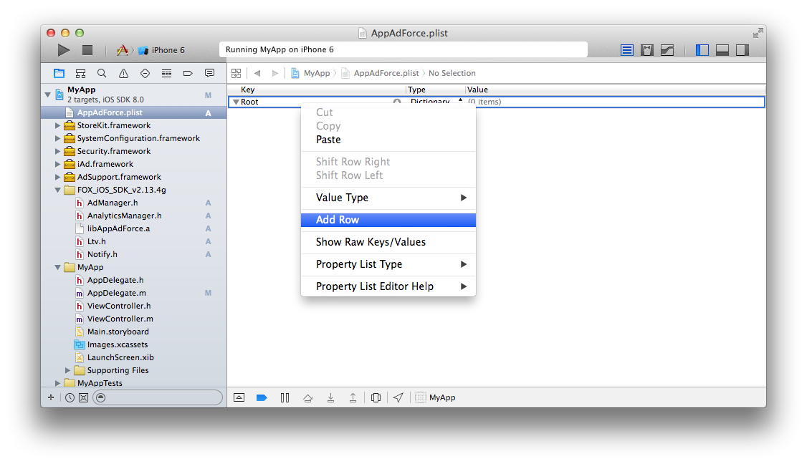

## SDK 설정의 상세

SDK의 동작에 필요한 설정을 plist에 추가합니다. 「AppAdForce.plist」 라는 명칭의 속성 목록 파일을 프로젝트의 원하는 위치에 생성하고 다음의 키와 값을 입력하십시오.

아무 곳이나 오른쪽 클릭 → 「New File ...」을 선택

「Property List」를 선택.

「AppAdForce.plist」라는 명칭으로 변경하고 Create 버튼을 클릭합니다.

생성 된 속성 목록 파일을 선택합니다. 오른쪽 클릭 메뉴를 열고 「Add Row」를 선택

각 키와 값을 설정.

설정 키와 값은 다음과 같습니다.

Key | Type | Value
:---: | :---: | :---
APP_ID | String | Force Operation X 관리자로부터 연락받은 값을 입력하십시오.
SERVER_URL | String | Force Operation X 관리자로부터 연락받은 값을 입력하십시오.
APP_SALT | String | Force Operation X 관리자로부터 연락받은 값을 입력하십시오.
APP_OPTIONS | String | 아무것도 입력하지 않고 빈 상태로 두십시오.
CONVERSION_MODE | String | 1
ANALYTICS_APP_KEY | String | Force Operation X 관리자로부터 연락받은 값을 입력하십시오. 액세스 해석을 이용하지 않을때는 설정이 필요 없습니다.

[AppAdForce.plist 샘플](./AppAdForce.plist)

---
[TOP으로](/lang/ko/README.md)
