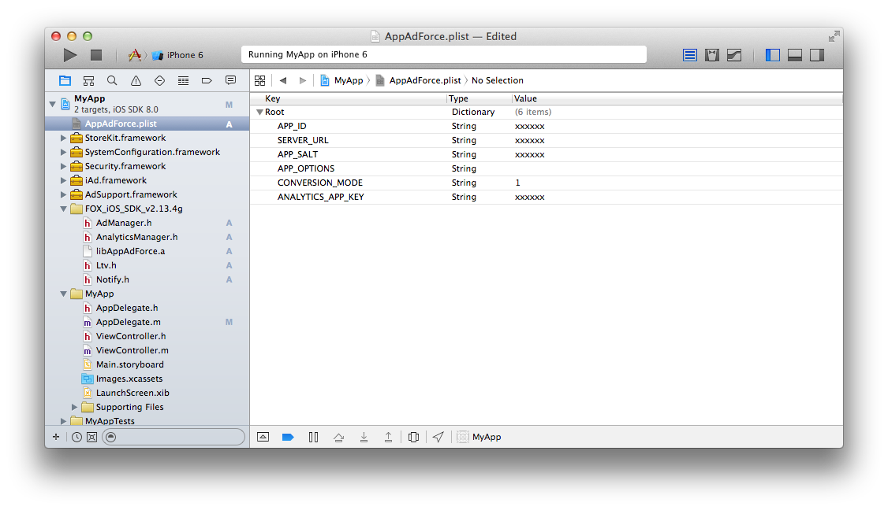

# Force Operation X是什麼

Force Operation X (下面簡稱F.O.X)是基於智慧手機的，用來最大改善廣告效果的綜合解決方案平台。除了對APP的下載和網絡上用戶操作的基本計測外，基於手機用戶的行動特性的獨自的效果計測基準，實現了企業宣傳推廣的費用效果比的最大改善。

在這個文檔裡，詳細講解了基於智慧手機來優化廣告效果的F.O.X SDK的導入步驟。

## F.O.X SDK是什麼

用導入F.O.X SDK到APP裡的方法來實現下面的功能。

* **Install計測**

能够按不同的广告流入来計測统计安装数。

* **LTV計測**

按不同的流入源廣告来計測Life Time Value。作為主要的成果地點，有會員登記，教程突破，消费等。能夠按照不同廣告来來檢測登錄率，消費率和收費額等。

* **流量分析**

自然流入和廣告流入的安裝數比較。能夠計測APP的啟動數，唯一用戶數(DAU/MAU)，持續率等。

* **PUSH通知**

使用F.O.X檢測的信息，能夠針對用戶來做PUSH通知。比如，能夠對從特定廣告流入的用戶來發送消息。

## 1. 安裝
* **按CocoaPods來導入的場合**

請在Podfile文件裡追加下面的設定。
```ruby
foxVersion = "master"
pod "foxSdk", :podspec => "https://github.com/cyber-z/public-fox-ios-sdk/raw/#{foxVersion}/cocoapods/foxSdk.podspec"
```
<br />

* **按手冊來導入的場合**

請從下面的頁面來下載最新的SDK。

[SDK發布頁面](https://github.com/cyber-z/public_fox_ios_sdk/releases)

已經在APP裡導入了SDK的話，請參考[有關更新到最新版本](./doc/update/README.md)

請解壓下載的SDK「FOX_iOS_SDK_<version>.zip」，把下面的文件複製到Xcode的任意一個地方，並導入到APP的開發項目裡。

各文件的說明如下。

<table>
<tr><th>功能名</th><th>必須</th><th>ファイル名</th></tr>
<tr><td>類庫本身</td><td>必須</td><td>libAppAdForce.a</td></tr>
<tr><td>Install計測</td><td>必須</td><td>AdManager.h</td></tr>
<tr><td>LTV計測</td><td>任意</td><td>Ltv.h</td></tr>
<tr><td>訪問計測</td><td>任意</td><td>AnalyticsManager.h</td></tr>
<tr><td>PUSH通知</td><td>任意</td><td>Notify.h</td></tr>
</table>


[安裝步驟的詳細](./doc/integration/README.md)

## 2. 設定

* **Framework設定**

請把下面的Framework鏈接到開發項目裡。

<table>
<tr><th>Framework名</th><th>Status</th></tr>
<tr><td>SafariServices.framework</td><td>Optional</td></tr>
<tr><td>AdSupport.framework</td><td>Optional</td></tr>
<tr><td>iAd.framework </td><td>Required</td></tr>
<tr><td>Security.framework </td><td>Required </td></tr>
<tr><td>StoreKit.framework </td><td>Required </td></tr>
</table>

> ※AdSupport.framework是在iOS 6以後追加的Framework，所以如果要讓APP在iOS 5及以前版本也能正常動作(設定iOS Deployment Target到5.1或以下)，為了進行weak link請設定成”Optional”。

> ※SafariServices.framework是在iOS 9以後追加的Framework，所以如果要讓APP在iOS 8及以前版本也能正常動作(設定iOS Deployment Target到8.4或以下)，為了進行weak link請設定成”Optional”。


[Framework設定的詳細](./doc/config_framework/README.md)

* **SDK設定**

為使SDK起作用，追加必要的設定到plist裡。請在開發項目的任意一個地方建立「AppAdForce.plist」這樣一個文件，並輸入下面那樣的鍵和值。

Key | Type | Value
:---: | :---: | :---
APP_ID | String | 請輸入Force Operation X管理員告知的值。
SERVER_URL | String | 請輸入Force Operation X管理員告知的值。
APP_SALT | String | 請輸入Force Operation X管理員告知的值。
APP_OPTIONS | String | 什麼也不要輸入，請保持空白的狀態。
CONVERSION_MODE | String | 1
ANALYTICS_APP_KEY | String | 請輸入Force Operation X管理員告知的值。<br />如果不利用流量分析的話沒有必要設定。




* **關於App Transport Security**

由iOS9提供的AppTransportSecurity(下面稱做ATS)設定為有效的時候、請在Info.plist裡做如下設定，並把使用F.O.X SDK進行通信的域名設置成ATS的例外。

Key | Type | 概要
:---: | :---: | :---
NSExceptionDomains|Dictionary|指定ATS例外的dictionary
指定域名文字列|Dictionary|請把下面兩個域名做成Key。<br>・app-adforce.jp<br>・forceoperationx.com
NSExceptionAllowsInsecureHTTPLoads|Boolean|請指定成YES，設置成ATS的例外。
NSIncludesSubdomains|Boolean|指定成YES ，把ATS的例外設定也適用到子域名。


[SDK設定的詳細](./doc/config_plist/README.md)

[AppAdForce.plist例子](./doc/config_plist/AppAdForce.plist)

## 3. Install計測的安裝

安裝了初次啟動時的Install計測，就能夠測定廣告效果。
另外，在iOS9環境初回啟動時，從瀏覽器啟動到返回APP的時候，會跳出對話框。
在F.O.X SDK裡，提供有iOS9開始發布的新WebView形式，在初回啟動時使用這個新形式的“SFSafariViewController”來計測的話，可以禁止彈出對話框來提高用戶體驗。

為了進行Install計測，請安裝下面兩個方法。

方法 | 安裝地點 | 概要
:---: | :---: | :---
sendConversionWithStartPage:|didFinishLaunchingWithOptions:|(必須) 初次啟動時的Install計測
setUrlScheme:|openURL:|(必須) 透過URLscheme的APP啟動（background）時的參數處理

請編輯開發項目的源代碼，按下面那樣來安裝到Application Delegateの`application:didFinishLaunchingWithOptions:`

在`sendConversionWithStartPage:`的參數裡，通常請按上面的樣子輸入@"default"這樣的文字列。
```objective-c
#import "AdManager.h"

// - (BOOL)application:(UIApplication *)application
//   didFinishLaunchingWithOptions:(NSDictionary *)launchOptions {

  [[AppAdForceManager sharedManager] sendConversionWithStartPage:@"default"];

  return YES; // openURL:為了調用方法請一定返回YES
// }
```

```objective-c
// - (BOOL)application:(UIApplication *)application openURL:(NSURL *)url
//                sourceApplication:(NSString *)sourceApplication annotation:(id)annotation {

          [[AppAdForceManager sharedManager] setUrlScheme:url];

          return YES;
// }
```

> `sendConversionWithStartPage:`這個方法在iOS9環境且用Cookie計測的時候請啟動SFSafariViewController來做計測。

> `setUrlScheme:`這個方法、在經由跳轉URL Scheme廣告的APP的Install計測和啟動SFSafariViewController的時候要進行控制處理，請在安裝代碼裡一定調用`openURL:`方法。

> ※使用 ”`openURL:(NSURL *)url options:(NSDictionary<NSString*, id> *)options`”的時候，也請安裝setUrlScheme:這個方法。


[sendConversionWithStartPage:的詳細](./doc/send_conversion/README.md)


* **Fingerprinting計測時的注意事項**

Fingerprinting計測使用WebView，在獨自定制化UserAgent的時候，會變得無法正常計測。
在把WebView的UserAgent定制化成獨自的字符串之前，請一定安裝下面的方法。
```objc
[[AppAdForceManager sharedManager] cacheDefaultUserAgent];
```

## 4. LTV計測的安裝

通過在會員登錄，教程突破，消費等任意的成果地點安裝LTV計測，能夠測定流入源廣告的LTV。不需要LTV計測的時候，可以省略本項目的安裝。

```objective-c
#import "Ltv.h"
// ...
AppAdForceLtv *ltv = [[[AppAdForceLtv alloc] init] autorelease];
[ltv sendLtv:{成果地点ID}];
```

為了進行LTV計測，有必要指定識別各成果地點的成果地點ID。請指定由sendLtv的參數發行的ID。

進行消費計測的時候，請按照下面那樣在完成消費處理的地方指定消費額和貨幣代碼。

```objective-c
#import "Ltv.h"
// ...
AppAdForceLtv *ltv = [[[AppAdForceLtv alloc] init] autorelease];
[ltv addParameter:LTV_PARAM_PRICE:@"9.99"];
[ltv addParameter:LTV_PARAM_CURRENCY:@"USD"];
[ltv sendLtv:{成果地点ID}];
```

在currency這個地方，請指定按[ISO 4217](http://ja.wikipedia.org/wiki/ISO_4217)定義的貨幣代碼。

[有關利用Tag的LTV計測](./doc/ltv_browser/README.md)

## 5. 流量分析的安裝

自然流入和廣告流入的安裝數比較。能夠計測APP的啟動數，唯一用戶數(DAU/MAU)，持續率等。不需要流量分析的話，可以省略次項目的安裝。

為了計測APP的啟動以及來自Background的恢復，請在application:didFinishLaunchingWithOptions:以及applicationWillEnterForeground裡追加代碼。


※使用background fetch技術的場合，background啟動狀態下也會調用
application:didFinishLaunchingWithOptions:方法，為了確保不會執行Install計測通知的方法，請用applicationState做狀態判定。


```objective-c
#import "AnalyticsManager.h"

// - (BOOL)application:(UIApplication *)application
//   didFinishLaunchingWithOptions:(NSDictionary *)launchOptions {

    If ([application applicationState] == UIApplicationStateBackground) {
        //Background時的處理
    } else {
        //Background狀態下不會被執行
        [ForceAnalyticsManager sendStartSession];
    }

//}

// - (void)applicationWillEnterForeground:(UIApplication *)application {

    [ForceAnalyticsManager sendStartSession];

//}
```

對於sendStartSession，請一定在上面兩個地方做安裝。


[依靠流量分析進行消費計測](./doc/analytics_purchase/README.md)

## 6. 進行疏通測試

在向Market申請以前，在導入SDK以後請做充分的測試，確認APP的動作沒有問題。

因為在啟動後只發生一次Install計測的通信，如果想要再次進行Install計測的話，請卸載APP再次安裝

**測試步驟**

1. 如果測試用的設備已安裝APP，須解除安裝
1. 透過測試用端末的「設定」→「Safari」→「Cookie和數據消除」刪除Cookie
1. 點擊弊司發行的測試用URL
1. 再移轉到Market
1. 在測試用端末上安裝測試APP<br />
1. 啟動APP，瀏覽器啟動<br />
若流覽器無法啟動，將代表沒有正常設定。請重新設定，若仍無發現問題，請與弊司聯繫。
1. 畫面移轉到LTV地點<br />
1. 結束APP，也從Background刪除<br />
1. 再次啟動APP<br />

請告訴鄙公司3，6，7，9的時間。在鄙公司這邊會確認是否正常被計測。鄙公司確認沒有問題的話，測試算正式完成。

> 測試用的URL請務必在標準的Safari裡使用。Chrome這樣的第三方瀏覽器，郵件APP，QR碼讀取APP等這些APP內部會用WebView發生跳轉，無法進行計測。

> 點擊測試URL的時候，有時候因沒有跳轉目的地而彈出錯誤對話框，這個不影響疏通測試。


[進行Reengagement計測的測試步驟](./doc/reengagement_test/README.md)

## 7. 其他機能的安裝

* [PUSH通知的安裝](./doc/notify/README.md)

* [Opt-Out的安裝](./doc/optout/README.md)

* [登錄在管理畫面裡的BundleVersion相對應的不同處理](./doc/check_version/README.md)

## FAQ（常見問題解答）

### F.O.X裡使用的BundleVersion是什麼？

在iOS裡BundleVersion具體是指下面兩個值。

* CFBundleVersion
* CFBundleShortVersionString

在F.O.X裡，出於管理的目的在使用上面的CFBundleShortVersionString值。


## 8. 最後請務必確認（到現在發生過的問題集）

### 8.1. 查看經由廣告進來的安裝數字，期待的數字比報告裡的統計數字要低。

Install計測的`sendConversionWithStartPage:`沒有被安裝到啟動即執行的地點的場合，在到達那個地點前脫離的用戶將不會被統計。

沒有特別的理由請將`sendConversionWithStartPage:`安裝在`application:didFinishLaunchingWithOptions:`裡面。安裝在別的地點的場合可能無法正確計測安裝數值。

在沒有安裝`application:didFinishLaunchingWithOptions:`的狀態下投放安裝成果型廣告的時候，請一定通知廣告代理店或者媒體負責人。在不能正常計測的狀態下投放安裝成果型廣告的時候，有可能被要求支付超過計測安裝數的廣告費用。


### 8.2. 未設定URL Scheme的發布引起的無法從瀏覽器跳轉到APP

為了進行Cookie計測，在啟動外部瀏覽器以後，需要利用URL Scheme跳轉到APP來返回到原來的畫面。這個時候有必要設定獨自的URL Scheme，未設定URL Scheme就發布了的場合將無法正常跳轉。

### 8.3. URL Scheme裡包含了大寫字母，無法證稱跳轉到APP

由於環境的不同，可能無法判別URL Scheme裡的大小寫字母，進而引起不能正常跳轉。因此URL Scheme請全部使用小寫字母來設定。

### 8.4. 由於設定的URL Scheme與其他APP的相同，導致了從瀏覽器跳轉到了其他APP

在iOS裡，設定同一個URL Scheme到多個APP的場合，啟動哪個APP是不確定的。由於無法明確地啟動特定的APP，設定URL Scheme的時候，請使用唯一的有一定複雜度的字符串。

### 8.5. 進行了在短時間獲得大量用戶的宣傳推廣後卻沒能正常計測

在iOS裡，啟動APP時一旦主線程被阻擋超過一定時間，APP獎被強制關閉。啓動時的初期化處理請不要在主線程裡向服務器進行同期通信。像成果報酬型廣告這類的在短時間獲取大量用戶的方式，會產生向服務器的機種訪問，通信響應變得非常差，APP的啟動會花費更長時間，這種情況下起動時會發生強制關閉APP而無法計測廣告成果的事情。

按下面的步驟能夠測試這樣的狀況，請按照下面的設定確認APP可否正常啟動。

`iOS「設定」→「DEVELOPE」→「NETWORK LINK CONDITIONER」``

* 開啟「Enable」
* 勾選「Very Bad Network」

---
[主菜單](/lang/README.md)
