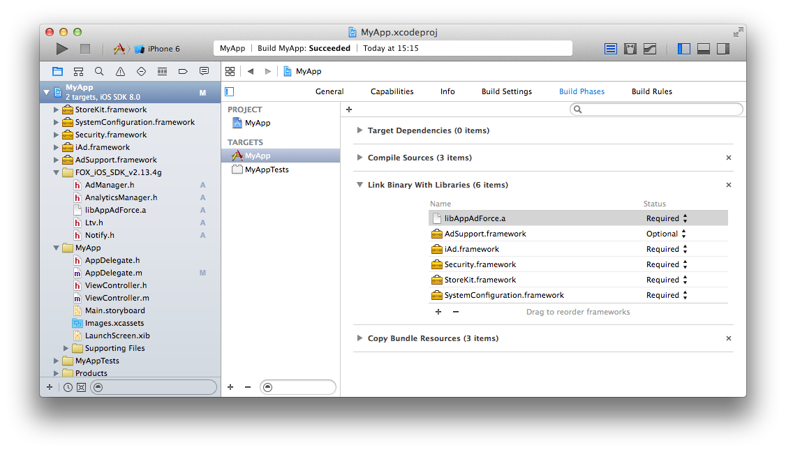

## Framework設定的詳細

點擊編譯對象，「Build Phases」→選擇「Link Binary With Libraries」。點擊「＋」按鈕，請選擇各Framework。

請把下面的Framework追加到開發項目裡。

<table>
<tr><th>Framework名</th><th>Status</th></tr>
<tr><td>SafariServices.framework</td><td>任意</td></tr>
<tr><td>AdSupport.framework</td><td>任意</td></tr>
<tr><td>iAd.framework </td><td>必須</td></tr>
<tr><td>Security.framework </td><td>必須</td></tr>
<tr><td>StoreKit.framework </td><td>必須</td></tr>
</table>

> ※AdSupport.framework是在iOS 6以後追加的Framework，所以如果要讓APP在iOS 5及以前版本也能正常動作(設定iOS Deployment Target到5.1或以下)，為了進行weak link請設定成”任意”。

> ※SafariServices.framework是在iOS 9以後追加的Framework，所以如果要讓APP在iOS 8及以前版本也能正常動作(設定iOS Deployment Target到8.4或以下)，為了進行weak link請設定成”任意”。

---
[TOP](/lang/tw/README.md)
