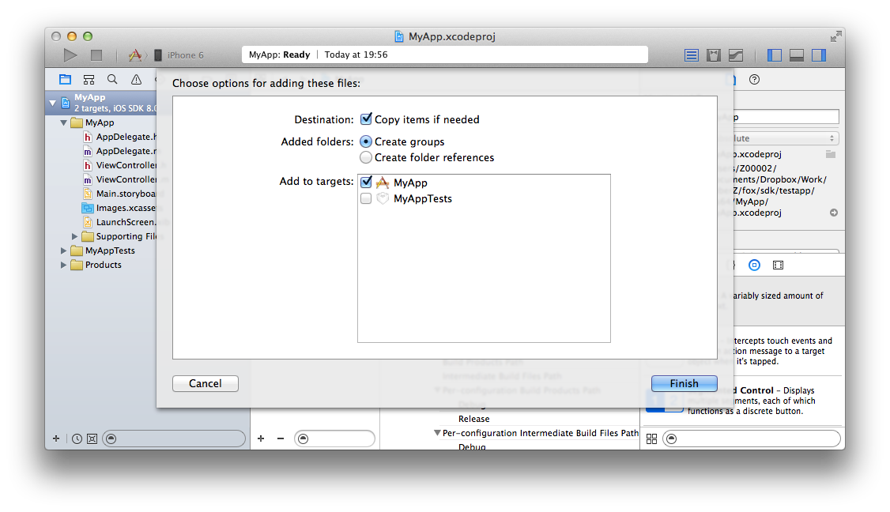

## 導入步驟的詳細

請解壓下載的SDK「FOX_iOS_SDK_<version>.zip」，把下面的文件複製到Xcode的任意一個地方，並導入到APP的開發項目裡。

各文件的說明如下。

<table>
<tr><th>功能名</th><th>必須</th><th>ファイル名</th></tr>
<tr><td>類庫本身</td><td>必須</td><td>libAppAdForce.a</td></tr>
<tr><td>Install計測</td><td>必須</td><td>AdManager.h</td></tr>
<tr><td>LTV計測</td><td>任意</td><td>Ltv.h</td></tr>
<tr><td>訪問計測</td><td>任意</td><td>AnalyticsManager.h</td></tr>
</table>

---
[TOP](/lang/zh-tw/README.md)
